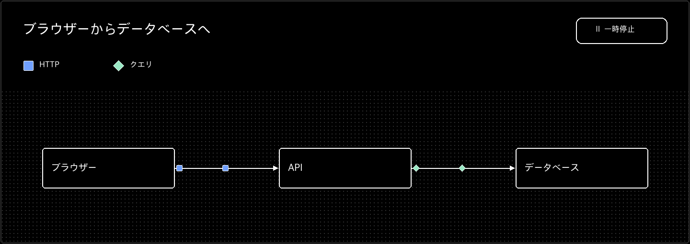

# Somen

日本語 | [English](README.md)

Somenは、HTMLでノードと接続を記述して、動きのあるフロー図を表示するWeb Componentです。ノードの配置と接続線の経路は、表示領域とHTML要素の大きさに合わせて計算します。

現在は開発中のalpha版です。ライセンスはMITです。



画像は3ノードの図に絞った動作イメージです。実際の図は一時停止・再生できます。

## ローカルで試す

開発環境はNode.js 24.13.0（`.node-version`）とpnpm 12.3.4（`package.json`の`packageManager`）に固定しています。フォームで図を編集するStudioは、次のコマンドで起動できます。

```sh
pnpm install
pnpm studio
```

Studioは `http://127.0.0.1:4766/` で開きます。Astroへの埋め込み例を見る場合は、リポジトリのルートで `pnpm dev` を実行してください。

## HTMLに組み込む

`npm install somenflow@alpha` で導入し、ブラウザー側のスクリプトでカスタム要素を登録すると、HTMLで図を定義できます。

```js
import 'somenflow/register';
```

```html
<flow-diagram label="通信の流れ" autoplay>
  <flow-node name="client">クライアント</flow-node>
  <flow-connection label="リクエスト"></flow-connection>
  <flow-node name="server">サーバー</flow-node>
</flow-diagram>
```

この例では、接続を二つのノードの間に置くことで接続元と接続先を省略しています。分岐や逆方向の接続では `from` と `to` を指定します。[埋め込み例](examples/astro-demo/src/pages/examples.astro)には、複数ノードと見た目の変更例があります。

## Astroの記事やデータに組み込む

Astroの`.md`と`.mdx`には、上と同じカスタム要素を本文に直接記述できます。MDXを使う場合は`@astrojs/mdx`の導入が必要です。図を表示する`.astro`ページまたはレイアウトの`<script>`で、`somenflow/register`を一度読み込んでください。[Markdown](examples/astro-demo/src/content/articles/markdown.md)と[MDX](examples/astro-demo/src/content/articles/mdx.mdx)の実例は、Content Layer APIのコレクションから[記事ページ](examples/astro-demo/src/pages/content/%5Bid%5D.astro)で表示しています。

JSONなどの構造化データをContent Layer APIで管理する場合は、`getEntry()`で取得したデータを`parseDocument()`で検証し、`toMarkup()`でHTMLに変換できます。[JSONの実例](examples/astro-demo/src/content/diagrams/request-flow.json)と[表示ページ](examples/astro-demo/src/pages/data.astro)も用意しています。Astroの`set:html`はHTMLをそのまま挿入するため、任意のHTML文字列ではなく`toMarkup()`の出力を渡してください。

## 対応範囲

Somenは、記事やドキュメントに入れる小さな通信図・処理フローを対象にしています。HTMLのほか、Studioで編集してJSONに保存し、CLIで検証・静的HTMLへの書き出しができます。詳しい要素・属性・CLIの使い方は[パッケージのREADME](packages/core/README.md)を参照してください。

ノードは記述順に並び、狭い表示領域では縦向きに切り替わります。自動再生は `autoplay` を指定した場合だけ有効です。複雑なグラフの自動配置や、線の完全な交差回避には対応していません。ブラウザー操作はChromiumで確認済みで、Firefox・Safari・支援技術は今後確認する予定です。

## 開発

貢献時の検査とリリース手順は[CONTRIBUTING.md](CONTRIBUTING.md)、脆弱性の非公開報告先は[SECURITY.md](SECURITY.md)を参照してください。

```sh
pnpm build       # コアをビルド
pnpm dev         # Astroデモを起動
pnpm test        # コアとCLIのテスト
pnpm code:check  # コアの整形・lint・型を検査
pnpm code:format # コアを整形
pnpm unused:check # 未使用ファイル・export・依存を検査
pnpm docs:check # Markdownとローカルリンクを検査
pnpm --dir examples/astro-demo build # Astroデモをビルド
```
